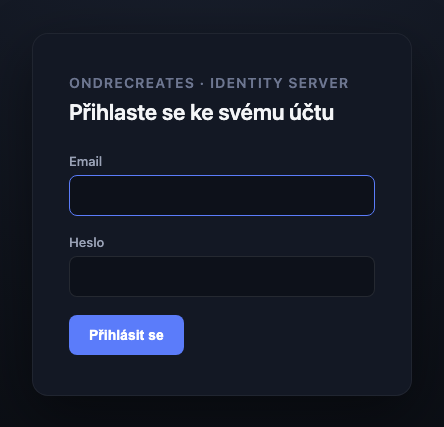
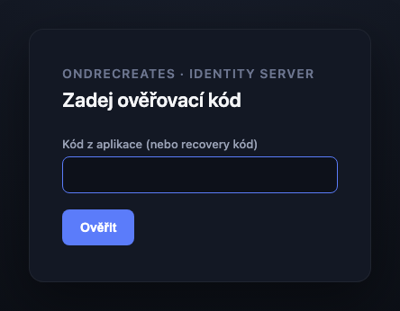
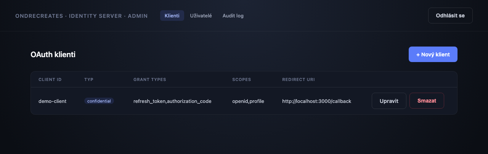
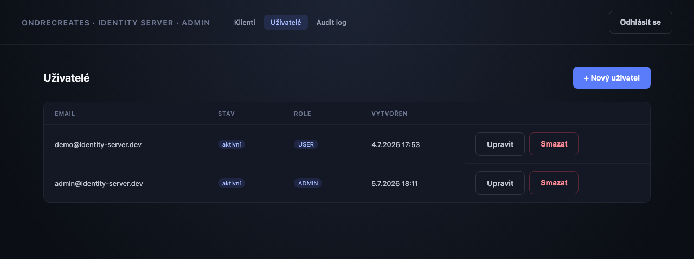
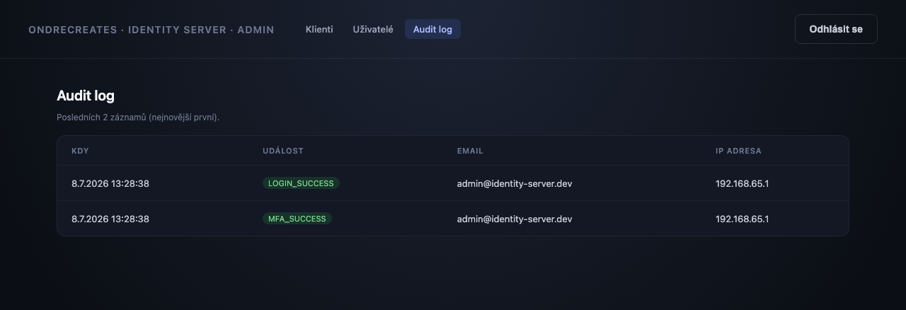
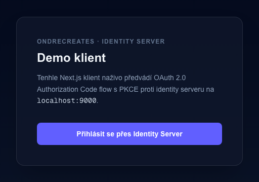
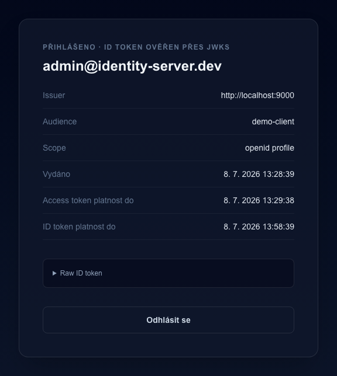

*[Čeština](README.md) | English*

# Identity Server

A self-hosted OpenID Connect / OAuth2 identity provider, built on **Spring Authorization
Server** (Spring Boot 4.1, Spring Security 7.1), with a small Next.js client demonstrating
the full login flow live.

This is a portfolio project, not a generic "JWT auth tutorial" clone. The goal was to show
real depth on the OAuth2/OIDC protocol and the ability to extend a production-grade
framework — not to roll a security-critical protocol implementation from scratch. Every
piece of the actual authorization code flow, token issuance, and PKCE validation is Spring's
own, unmodified. What's custom is everything around it: the login/admin UI, the user and
MFA data model, the audit trail, and the second-factor enforcement wired into Spring
Security 7.1's new multi-factor authentication mechanism.

## Screenshots

<table>
<tr>
<td width="50%">

**Login**<br>
Custom login page (Thymeleaf), not a Spring Authorization Server default template.



</td>
<td width="50%">

**Two-factor challenge (TOTP)**<br>
Only shown to users who enrolled in MFA themselves (see the Features section below).



</td>
</tr>
<tr>
<td width="50%">

**Admin — OAuth clients**<br>
CRUD over `oauth2_registered_client`, gated to `ROLE_ADMIN`.



</td>
<td width="50%">

**Admin — users**<br>
With self-lockout guards (an admin can't remove their own role or delete themselves).



</td>
</tr>
<tr>
<td width="50%">

**Admin — audit log**<br>
A live source of truth for the lockout mechanism, not just a passive record.



</td>
<td width="50%">

**Demo client — home page**<br>
The Next.js app that drives and demonstrates the whole OAuth flow live.



</td>
</tr>
<tr>
<td colspan="2">

**Demo client — profile after login**<br>
ID token verified via JWKS (issuer, audience, scope, expiry), not just "you're logged in".



</td>
</tr>
</table>

## Architecture

```
┌─────────────┐      OAuth2 / OIDC       ┌────────────────────┐      JDBC      ┌───────┐
│ Next.js demo│ ───────────────────────► │  Identity Server    │ ─────────────► │ MySQL │
│   client    │ ◄─────────────────────── │ (Spring Auth Server) │ ◄───────────── │       │
└─────────────┘   authorization_code     └────────────────────┘                └───────┘
                    + PKCE, JWKS
```

- **identity-server** — the OIDC provider itself. Two security filter chains: one for the
  `/oauth2/*` and `/.well-known/*` endpoints (Spring Authorization Server's own), one for
  everything else (login page, account/MFA management, admin panel).
- **demo-client** — a confidential OAuth2 client (Next.js, server-side route handlers only,
  no SPA token handling) that exercises the full flow: authorization code + PKCE, refresh
  token rotation, revoke, ID token verification via JWKS.
- **MySQL** — `oauth2_registered_client`, `oauth2_authorization`,
  `oauth2_authorization_consent` use Spring's own standard schema (not reinvented). Custom
  tables: `app_user`, `user_role`, `mfa_secret`, `mfa_recovery_code`, `audit_log`.

## Features

- **Core OIDC**: authorization_code grant with mandatory PKCE, custom login page, JWKS
  endpoint with an RSA-signed JWT.
- **Token lifecycle**: refresh token rotation (`reuseRefreshTokens=false`), revoke endpoint
  wired into client logout.
- **Admin panel**: CRUD over OAuth clients and users, gated to `ROLE_ADMIN`, with guards
  against an admin locking themselves out (can't remove their own admin role, disable, or
  delete their own account).
- **MFA (TOTP + recovery codes)**: enforced at login using Spring Security 7.1's *native*
  multi-factor authentication primitives (`FactorGrantedAuthority`,
  `AuthorizationManagerFactories.multiFactor()`) rather than a hand-rolled session-flag
  scheme — conditional per-user (only enrolled users are challenged), not a global toggle.
  Recovery codes are single-use and hashed at rest; the TOTP secret is encrypted (not
  hashed) since it has to be read back to verify codes.
- **Audit log**: every login and MFA attempt (success and failure) is recorded, including
  failed attempts against emails with no matching account (`user_id` is nullable for
  exactly this reason) — driven by a listener on Spring Security's own authentication
  events, not scattered manual logging calls. Viewable in the admin panel, and it isn't
  just passive: repeated failures against the same account (5 within 15 minutes) lock out
  further password *and* TOTP attempts, reusing this same log as the source of truth rather
  than tracking attempts separately.
- **MFA disable requires re-proving the second factor.** An authenticated-but-not-yet-
  TOTP-verified session (the state right after a password-only login, before the MFA
  challenge) can reach the account's MFA settings page — deliberately, so finishing
  enrollment doesn't lock a fresh session out of its own recovery codes — but disabling MFA
  itself still requires the current TOTP code or a recovery code, so a hijacked
  password-only session can't strip 2FA off the account.
- **Tests over the critical paths**: full OIDC flow, admin RBAC + self-lockout guards, MFA
  enforcement (including the wrong-code/recovery-code/admin-route-gating cases), and audit
  log correctness — run via MockMvc against a real Testcontainers MySQL, no dependency on a
  pre-running database.
- **One-command local stack**: `docker compose up` builds and runs MySQL, the identity
  server, and the demo client together.
- **CI**: GitHub Actions runs the backend test suite and the frontend lint + build on every
  push.

## Quick start

```bash
cp .env.example .env                        # generate real values for a non-demo setup
cp demo-client/.env.example demo-client/.env.local
docker compose up --build
```

Then open **http://localhost:3000** and click through the login flow. The demo admin
account (seeded by Flyway) is `admin@identity-server.dev` / `admin123` — change or remove
it before this ever runs anywhere but your own machine.

### Running without Docker

```bash
docker compose up mysql              # just the database
mvn spring-boot:run                  # identity server on :9000
cd demo-client && npm install && npm run dev   # demo client on :3000
```

### Tests

```bash
mvn test
```

Uses Testcontainers to spin up a throwaway MySQL — no running database required, and
verified to work with the docker-compose stack stopped.

## Notable design decisions

- **Built on Spring Authorization Server, not a hand-rolled OAuth2 implementation.**
  Rolling your own authorization code flow is a well-known security foot-gun and an
  indefensible choice in an interview ("why didn't you use the vetted library"). The value
  demonstrated here is extending and correctly configuring a production framework, not
  reimplementing a protocol.
- **demo-client is a confidential client, not a public SPA.** Its OAuth calls all happen in
  Next.js route handlers (server-side), so a client secret can be held safely. This also
  unlocks refresh tokens — Spring Authorization Server never issues one to a client using
  `client_secret: none`, since such a client can't prove it's the same party the token was
  issued to when redeeming it.
- **MFA enforcement uses Spring Security 7.1's built-in multi-factor primitives.** This
  turned up a real, non-obvious framework behavior: registering a custom
  `AuthorizationManagerFactory` bean rewires *every* plain `.authenticated()` /
  `.hasRole()` call in the whole app to route through it — there's no such thing as an
  "unfactored" check once that bean exists. Routes meant to stay reachable with just a
  password (e.g. a user's own MFA settings page, before they've completed the challenge)
  have to bypass the factory explicitly via `AuthenticatedAuthorizationManager`.
- **`audit_log.user_id` is nullable on purpose.** A failed login against an email with no
  matching account still needs to be recorded (that's a security-relevant signal), and
  there's no user row to attach it to.
- **Docker Compose needed two different base URLs for the demo client**, not one: the
  browser must be redirected to `/oauth2/authorize` at a host-reachable address
  (`localhost:9000`), while the token/JWKS/revoke calls the demo client itself makes need to
  reach the identity server over Compose's internal network (`identity-server:9000`). The
  `iss` claim baked into every token always stays the public address, since that's what's
  actually signed into the JWT regardless of which URL fetched it.

## Known limitations (deliberate, not oversights)

- **The JWT signing key is generated in memory on every restart.** Fine for a demo; a real
  deployment would need a persisted (and rotatable) key, or a KMS. Restarting the server
  invalidates every previously-issued token.
- **Access/refresh token lifetimes are short** (1 minute / 30 minutes) specifically so
  refresh-on-expiry is observable in a live demo without waiting around — not a production
  value.
- **The seeded admin account and default secrets** (`DEMO_CLIENT_SECRET`,
  `MFA_ENCRYPTION_KEY`) are dev-only placeholders committed to `.env.example` for a
  zero-friction `docker compose up`. Replace all of them before running this anywhere
  reachable by anyone else.

## Roadmap — what's next

- Multi-tenant retrofit of other projects (e.g. a Monitoring Dashboard app) as OAuth2
  clients of this identity server — deliberately out of scope for the MVP, not a blocker.
- Persistent/rotatable JWK signing key for real deployments.
- WebAuthn/passkeys as an additional MFA factor alongside TOTP.
